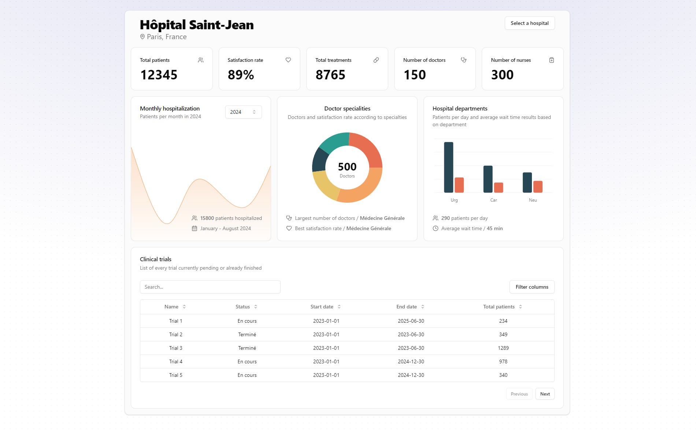

# Tekkare dashboard



## Project Overview

In this project I've been challenged to create a landing page for a dashboard. I tried to build something clean, readable avoiding too much information for the user. 


## Technology Stack

Here's an overview of the main technologies I've used in this project. For detailed dependencies, check the package.json.


### Primary Stack

| Technology                                           | Purpose                                       |
| ---------------------------------------------------- | --------------------------------------------- |
| [React.js](https://react.dev/)                       | Fast way to set up (init with vite.js)        |
| [TypeScript](https://www.typescriptlang.org/)        | Type safety                                   |
| [Tailwind CSS](https://tailwindcss.com/)             | Styling                                       |
| [Shadcn/ui](https://ui.shadcn.com/)                  | Building accessible components                |
| [TanStack Table](https://tanstack.com/table/v8)      | Headless table component for data display     |


## Run Locally

1. Clone the repository:

   ```bash
   git clone https://github.com/rum7/tekkare-dashboard.git
   ```

2. Navigate to the project directory:

   ```bash
   cd tekkare-dashboard
   ```

3. Install the dependencies:

   ```bash
   npm install
   ```

4. Start the development server:

   ```bash
    npm run dev
   ```

5. Open your browser and navigate to [http://localhost:5173](http://localhost:5173).